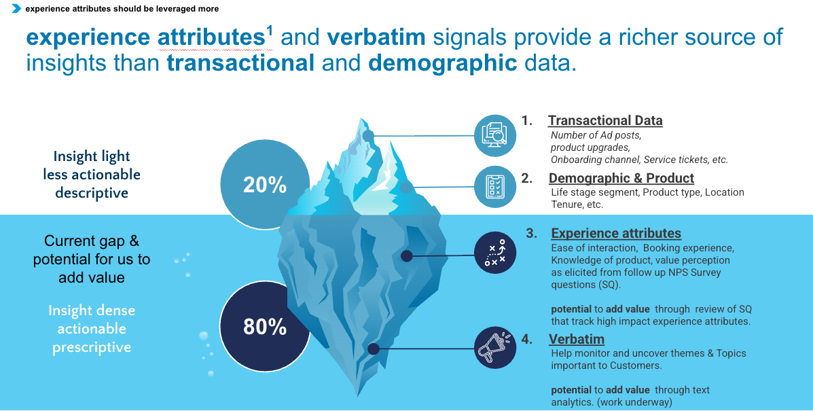

### What is CX Driver Modelling?

A data-driven methodology solving the CX prioritisation problem: determining which operational 
improvements will actually increase customer satisfaction.

### The Challenge:
Businesses collect rich feedback (NPS surveys, behaviour data, demographics) but lack objective 
framework for prioritising improvement initiatives. Should you fix delivery speed, product 
quality, or customer service first? Which delivers best satisfaction ROI?

### The Solution:
By leveraging ML we can surface what factors separate satisfied customers from dissatisfied ones at the model level. 
By analysing what differentiates Promoters from Detractors across multiple data sources and validating our hypothesis,
we quantify each factor's likely impact on satisfaction.

